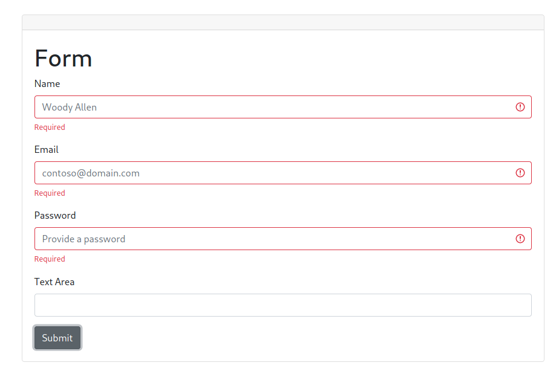

# Form-React-Challenge

### Generar una app web en React donde muestre el siguiente formulario:

### Puntos a tener en cuenta :
- Los 3 primeros campos deben ser obligatorios
- Al hacer click en Submit debe generar un objeto con la estructura `{name:input.value, email: input.value, password: input.value, textarea: input.value}`, el cual deberá mostrarse en un modal en formato de JSON.
- Sólo deberá aparecer el modal en caso de tener completo los campos requeridos (sugerimos usar Formik para validación)
- El estilo es libre pero debe respetar la sobriedad del ejemplo.
- Se evaluará aparte de la funcionalidad, la atomicidad del código (códigos breves y bien divididos)

### Tecnologías usadas
* React
* Webpack
* Babel
* JavaScript
* HTML
* CSS

### Correr el proyecto
1. Clonar repo
2. Abrir una terminal ejecutar `npm install`
3. Luego ejecutar `npm start`

### Deploy 
* https://facundo37858.github.io/form-react-challenge/